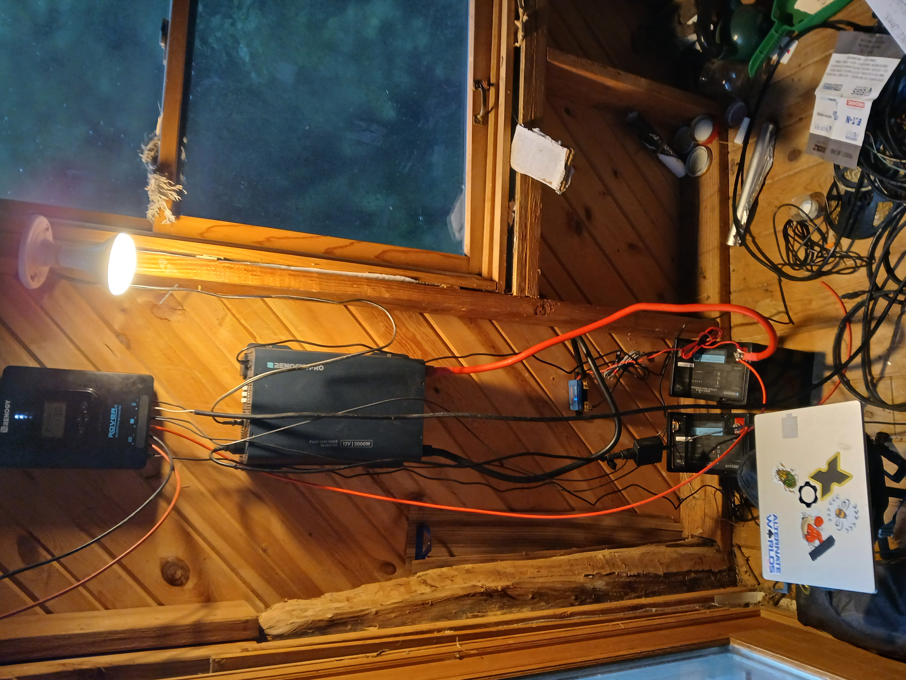

# Solar System

## August 12, 2026 - [Switches, Fuses, Wires]

The Treehouse has solar.

At the end of last month, my father and brother drove up from Kansas City with green 2x4s, wires, screws, and electric tools. I watched as the work and decisions that would have taken me months happened in one afternoon.

Now I'm here trying to understand what I have on my wall, and figuring out how to install fuses, breakers, bus bars, and switches.

As before, I'm looking for help in knowing what to order, and how to safely wire it all up. Let me know if you have any interest in helping with or watching the physical wiring, and I'll tell you when the parts get here.

### Story

"You don't think he's on the roof, do you?" my brother asked. We'd taken a break, gone to cool off by the pond. My father had kept working, wanting to get everything installed that day, rather than staying the night. Considering all that had to get done: running wires through the walls, hooking the batteries to the controller, the shunt, and the inverter, I was skeptical we could finish. I also realized the next step would be mounting the panels, and we'd left our father by himself.

"Yeah," I said, "he's probably on the roof."

### Parts 

| Component | Spec | Why |
|---|---|---|
| [200Amp ANL Fuse](https://www.amazon.com/gp/product/B06XYDG6XV/ref=ox_sc_act_title_7?smid=A2VHGGOHXF24LJ&psc=1) | 200A, includes 12" 1/0 AWG cable, 5/16" stud | Protects the shared cable from the battery bank to the inverter, sized to the inverter's real peak draw at full load |
| [Disconnect Switch](https://www.amazon.com/gp/product/B00EBQOKEQ/ref=ox_sc_act_title_5?smid=A1ITINQVQ7HDWW) | 12V/24V/48V, 300A continuous | Single manual off-point for the whole system — so you can work on any downstream wiring without disconnecting live cables |
| [Positive and Negative Bus Bars](https://www.amazon.com/gp/product/B0DGGKXX3C/ref=ox_sc_act_title_4?smid=AURES3XE1VYF1) | Matched pair, 250A, 5/16" studs | Common tie point for every branch circuit instead of stacking wires on the battery terminal directly; negative bar routes through the SmartShunt's system side so it sees all outgoing current |
| [Wire Stripper and Crimper](https://www.amazon.com/gp/product/B0C3GRTT2G/ref=ox_sc_act_title_2?smid=A32VX1OUD7LME2) | Ratcheting mechanism | Makes the actual mechanical connection inside a heat-shrink terminal — the crimp is the electrical joint, the heat step after is just a weatherproof seal |
| [Crimp Kit](https://www.amazon.com/Wirefy-Heat-Shrink-Spade-Connectors/dp/B07KYMNZMX?ref_=ast_bl_cpl_dp) | Assorted ring/spade/butt terminals, 22-10 AWG, adhesive-lined heat shrink | Terminates wire ends onto bus bar studs, fuse block terminals, and switches |
| [Multimeter](https://www.amazon.com/gp/product/B071JL6LLL/ref=ox_sc_act_title_9?smid=A2NOFZGOKNP3PJ) | True RMS, auto-ranging, AC/DC | Confirming a circuit is actually dead before touching it, checking voltage and continuity while troubleshooting |
| [Switches](https://www.amazon.com/gp/product/B07SGWXB3P/ref=ox_sc_act_title_3?smid=AVZNWT0O79W01) | 12V 20A waterproof rocker, LED lit | Manual on/off for individual circuits downstream of the fuse block |
| [Fuse Box](https://www.amazon.com/gp/product/B001P6FTHC/ref=ox_sc_act_title_11) | Blue Sea ST Blade Fuse Block, 12 circuit + ground, 100A | Houses the individual branch fuses below, gives every DC load its own protected, switchable circuit |
| [Fuses](https://www.amazon.com/gp/product/B07VWRK2VD/ref=ox_sc_act_title_1?smid=A3NON9NCBFQHD7) | ATO blade assortment, 2A-35A | Matched to each branch's actual wire gauge and load — a light circuit and a charging circuit don't need the same rating |

#### Battery Fuses

One thing they didn't bring, and that I knew was necessary to run the setup safely, were fuses and breakers. The diagrams from user guides I was looking at always showed fuses *in between each connection*, and the internet suggested that each fuse needed to be matched to the right gauge of wire, and the Amps needed to trigger it.

A few days after his visit, my dad emailed recommending "a 30 amp DC breaker in series on each battery". My method has been to add everything either AI or people have told me I need to an Amazon cart, and then having another LLM review it and tell me what is wrong or missing.

Claude, in a recent iteration, told me "your 2000W inverter at 12V can pull upward of 150-160A under load...the 30A DaierTek breakers are too small for this role; they're right-sized for individual branch circuits (a light, a USB charger, a small accessory), not the main battery feed. You need a single higher-rated fuse or breaker (ANL fuse in the 150-200A range is typical for a 2000W inverter setup) inline at the battery terminal, before anything else."

I'm inclined to believe my father, with a life-time of engineering experience, over newly awakened ghosts of disembodied syntax, but I wanted to hear other opinions, too. 

Let me know if you think any of the following things are unnecessary, the wrong type, or if you know of a better way.

#### Disconnect Switch

I need a way to manually cut off the power from the batteries to everything else, so I don't shock myself playing with wires.

#### Bus Bars

My understanding is that while wiring everything to the battery bolt like we have now is fine, but adding a fuse box or bus bar will be safer, and on the negative end allow me to connect different DC outputs.

#### Heat shrink, crimp kit, ratcheting crimper

This is where I feel like AI might be selling me things I don't need. This is all supposedly to get the wiring crimped onto the bus bars.

I'm pretty sure I've seen wire strippers and crimpers around the ecovillage. Any leads?

> In order to heat-crimp wires, a heat gun is recommended, but you can also use a lighter...one place where I'm saving money.

#### Multimeter

This seems like a tool worth having, so I know what is going through the wires.

#### Fuse Box

I eventually want to have several DC loads (lights, etc) going through a fuse box. My dream is to wire everything through a Raspberry Pico to control it with code, but that can wait for more essential projects.

---
### Story, Continued

He was on the roof.

We screwed the frame into the metal, a weird, south-facing angle, close to 45 degrees, using dabs of silicon rubber to stop any leaks.

We'd gone to Rose hardware in Memphis to buy nuts to go with bolts we'd found in the machine shed. My dad had refused to buy washers, because the price (thirty cents or so each) was too much.

When I mis-measured distances between drill holes, and had to wiggle the drill around to get the bolt to fit, I said, "Now the bolt is just going to sink down into the hole..."

"Too bad we don't have any washers," my dad replied.

There was power. They'd brought a couple lights to plug into the inverter, and my dad showed me how to take one of the led strips ("There are the lights I take to Burning Man, but I guess I can buy more") and by touching the right wires together, got them to luminate in different colors. 

I left them on, live wires crimped into little plastic caps, wound up in a spool. After they left, I went back up and found that the plastic spool was melting, along with the adhesive on the back of the strip. I untwisted the wires, and unwound the lights, deciding not to try to wire anything else up to DC until I at least had some fuses hooked up.

___
## July 16, 2026 - Initial Solar Setup Planning

The problem of choosing an off-grid solar setup for a small, stilt-supported cabin has a particular combination of my own lack of expertise, and significant expense, that makes me nervous enough to sincerely request any input you might have.  

> Note: the selection of components, as well as the reasoning, is the result of my using Artificial Intelligence (mostly Claude), and not my own understanding. This is one of the reasons I would like humans, whose opinions I value, in the loop.
 
### The Gear

> Note: Component name links to site where I plan to order from.

| Component | Spec | Why |
|---|---|---|
| [Solar panels](https://www.renogy.com/pages/200-watt-12-volt-monocrystalline-solar-panel-rsp200d-html) | 2× Renogy 200W | I plan to use solar to run some LED lights, charge a phone and laptop, and run some tools with minor draw like a small fan. 400W should be enough for this, but not anything like a fridge or mini-split. Two panels rather than one gives me more options for placement and replacement. Should pair well with the 100Ah/12V battery. |
| [Charge controller](https://www.renogy.com/pages/rover-li-40-amp-mppt-solar-charge-controller-rng-ctrl-rvr40-html) | 40A MPPT | Right size for the panel array, MPPT should get more power than cheaper PWM controllers. The 400W array should only draw roughly 33A max at 12V |
| [Battery](https://www.renogy.com/products/12-8v-100ah-lithium-iron-phosphate-battery) | 100Ah LiFePO4 | LiFePO4 will last longer than a lead-acid battery. Also lighter and smaller. |
| [Inverter](https://www.renogy.com/products/2000w-12v-pure-sine-wave-inverter) | 2000W pure sine | Apparently more efficient and safer than modified sine.|
| [Battery monitor](https://www.victronenergy.com/battery-monitors/smart-battery-shunt) | Victron SmartShunt |This should let me monitor the battery's state of charge (the current going in and out). Hooks up with Bluetooth app to analyze data and trends.|

### What I'd like feedback on

Mostly I just don't want to do anything stupid, or waste money. Once I have the system, my father has offered to help install it, but the more eyes and hands on this project the better I will feel.

### How to weigh in

Email, call, or talk to me in person! If you don't have time to reach out in the relevant window, or don't feel like you have anything to add on the solar question, don't worry: there will be plenty of other opportunities to offer advice or criticism in the future.
